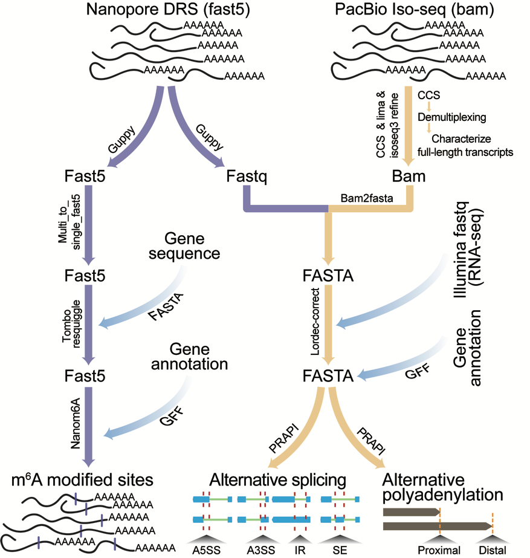
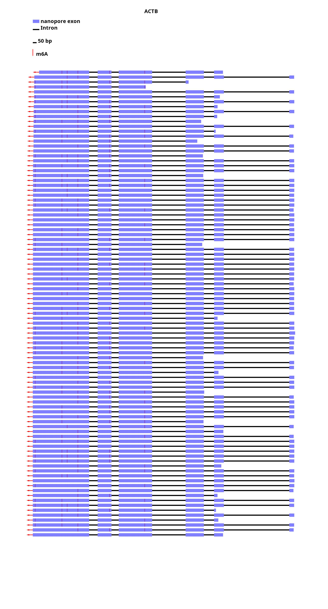
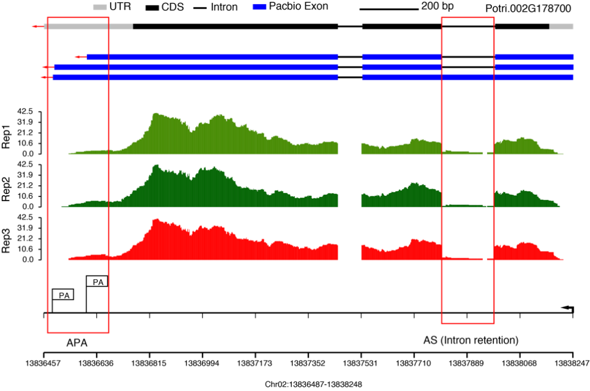

[](http://www.gnu.org/licenses/gpl-3.0)

# NanoPrapi

Nanopore sequencing based on Oxford Nanopore Technologies (ONT) and Pacific BioSciences (PacBio) single-molecule real-time (SMRT) long-read isoform sequencing (Iso-Seq) have shown great potential in detecting RNA modification and post-transcriptional regulation. This is a comprehensive computational procedure for the quantification of RNA modification in single-base resolution based on DRS data. Moreover, we also provided procedure on the identification of alternative splicing (AS) and alternative polyadenylation (APA) based on both DRS and PacBio Iso-Seq data. The entire step was based on two packages (Nanom6A and PRAPI), which were based on Python language on Linux system.

This pipeline include nanom6A([https://github.com/gaoyubang/nanom6A](https://github.com/gaoyubang/nanom6A)) to identify m6A in single-base

and

PRAPI([http://forestry.fafu.edu.cn/tool/PRAPI/help.php](http://forestry.fafu.edu.cn/tool/PRAPI/help.php)) to detect AS and APA events.


## Overview of the workflow: 
This is the workflow to show a step-by-step pipeline to identify m6A, AS and APA with long reads data.



## Installation

- __Running environment__: 
    - The workflow was constructed based on the __centos__ and __ubuntu__.

- __Required software and versions__: 
    - [Anaconda](https://www.anaconda.com/) or [Miniconda](https://docs.conda.io/en/latest/miniconda.html)
    - [Guppy](https://community.nanoporetech.com/downloads) v3.6.1
    - [Ont_fast5_api](https://github.com/nanoporetech/ont_fast5_api) v0.3.2
    - [Tombo](https://github.com/nanoporetech/tombo) v1.5.1
    - [Nanom6A](https://github.com/gaoyubang/nanom6A) 2021_3_18 version
    - [PRAPI](http://forestry.fafu.edu.cn/tool/PRAPI/)
    - [LoRDEC](https://gite.lirmm.fr/lordec/lordec-releases/-/wikis/home) v0.9
    - [Picard](https://github.com/broadinstitute/picard) v2.26.8
    - [GMAP](http://research-pub.gene.com/gmap/) version 2019-12-01
    - [python](https://www.python.org/)


## Input Data

1.For m6A identification based on nanom6A, input data should be genome file, transcriptome reference sequences and fast5 file generated by using Oxford Nanopore platform.

2.For identification of AS and APA based on PRAPI, input file should include genome file, annotation file (genePred format), long reads data, which was generated by Third Sequcencing Technologies and corrected by LoRDEC.


### tombo
In this step you should provide reference transcript sequence for tombo to resquiggle.
`reference transcript sequence` could be extracted by gffread.
For example:
```
gffread -w transcript.fa -g genome.fa *.gtf
```


### nanom6A
#### Files in input/nano are testing for nanom6A but not guppy or tombo. 
- Example FAST5 file in nanom6A: `input/nano/Test.fast5`
- Example genome file in nanom6A : `input/nano/genome.fa`
- Example bed6 file in nanom6A: `input/nano/anno.bed`

The `fast5` file from Nanopore DRS, which included raw signal, is stored in HDF5 format and could be viewed by [HDFView](https://www.hdfgroup.org/downloads/hdfview).
This is a typical fast5 file:


Each entry in a `FASTA` files consists of 2 lines:  

1. A sequence identifier with information about the sequencing run and the cluster. The exact contents of this line vary by based on the BCL to FASTQ conversion software used.  
2. The sequence (the base calls; A, C, T, G and N).   

The first entry of the input data:
```
>chr
cctagcacaTTGAGTTTCATCTCATAACCCCCAGGCCTCTTTCCCCCTCCAACTTCATAGGCTTGATCCACTTATTAG...
```

The bed file `anno.bed` corresponding to each gene:
```
chrom   st  ed  name    .   strand
chr7    10000 13453 ACTB    .   -
```


### PRAPI
- Example long read file in PRPAI: `input/prapi/data/pacbio.fa`
- Example genome file in PRPAI: `input/prapi/data/new.fa`
- Example conf file in PRPAI: `input/prapi/conf.txt`
- Example RNA-seq bam file in PRPAI: `input/prapi/data/new_bam/*bam`
- Example annotation file in PRPAI: `input/prapi/data/phe.txt`


Configuration file `conf.txt` can be edited by Vim text Editor in Linux system and contains several important parameters:

-Long read: PacBio Iso-seq or DRS long reads with FASTA format

-Genome_Annotion file `phe.txt`: Reference annotation with [GenePred](https://genome.ucsc.edu/FAQ/FAQformat.html#format9) format


## Major steps

### Install the dependence

```
sh workflow/1_install_environment.sh
conda activate prapi_env
pip install -i https://pypi.anaconda.org/gaoyubang/simple splicegrapher
```

### Usage for Nanom6A

#### Step 1: Download nanom6A package
Download nanom6A_2021_3_18.tar.gz package can be downloaded from following link:
[https://drive.google.com/drive/folders/1Dodt6uJC7lBihSNgT3Mexzpl_uqBagu0?usp=sharing](https://drive.google.com/drive/folders/1Dodt6uJC7lBihSNgT3Mexzpl_uqBagu0?usp=sharing)

Make sure the package and the script in the same directory

#### Step 2: Test the environment for nanom6A

```
conda activate nanom6A_env
tar -xvf nanom6A_2021_3_18.tar.gz && cd nanom6A_2021_3_18
sh run_binary.sh
```

#### Step 3: Identification of modified nucleotide using nanom6A
Before running this shell for identificating m6A, make sure your input date `genome file, transcipt file, bed file` perpared.

```
sh workflow/2_run_nanom6A.sh
```


### Usage for PRAPI

#### Identification of AS and APA 

```
sh workflow/3_run_prapi.sh
```


## Expected results

The result directory of __nanom6A__ includes ratio.x.tsv which contains the information of gene name, chromosome, the coordinate site of m6A, the number of m6A modified reads, the number of total reads, and the ratio of the m6A site. The file named genome_abandance.x.bed contains information of name and coordinate information of chromosome, gene name, ID and position of single FAST5 read and motif (kmer). The x in ratio.x.tsv and abandance.x.bed represents the probability of modification. The default probability is 0.5. And result including ratio.x.tsv and abandance.x.bed can be plotted in this command:

```
nanoplot --input /prediction step output/  -o plot
```
for example:
```
nanoplot --input result_final  -o plot_nano_plot
```

The output figure provides structure of transcripts and m6A sites highlighted by purple vertical line



In __PRAPI__, The visualization of AS and APA contains two categories in the output directories: Annotation_Gene and Novel_Gene, which represented long reads located in annotated region and unannotated region, respectively. For example, the graph from Potri.002G178700 shows AS and APA events:

